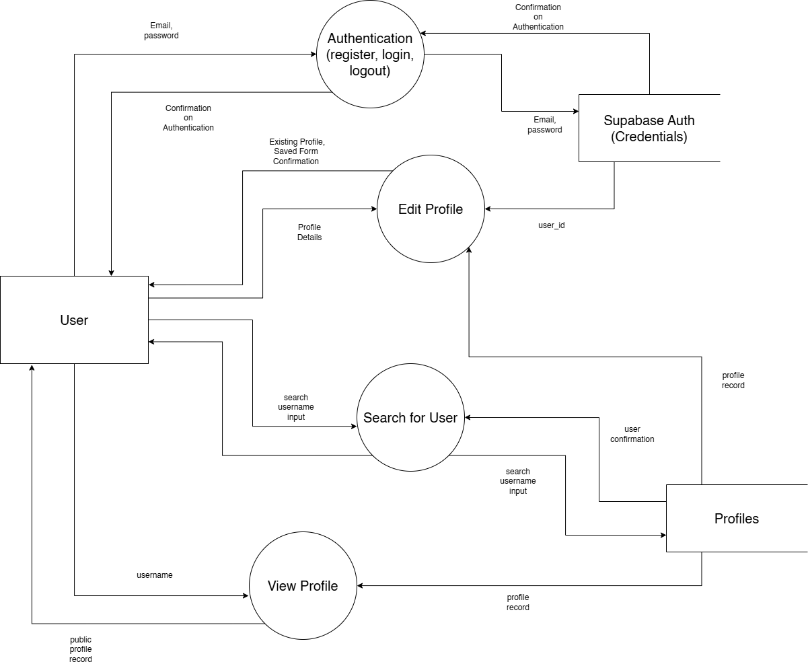

# Researching and Planning:

1. Gantt chart containing major tasks, the dependencies between them, and when they should take place. 

    Gantt Chart is an excel spreadsheet called "Gantt Chart". I used a template found within Excel.

    For milestones, they are the tasks which are underlined and italicised. The Gantt Chart is dynamic. You can change the display week to see the chart from a specific week (e.g. Week 3 will show April 13th onwards). There is also progress percentage counters for each task, and they affect the gantt chart through conditional formatting.

    Dependencies are grouped by each stage (I&D, R&P etc).

2. What software development approach (Waterfall/Agile/Wagile) will you be using and why.
    
    I will be using the Agile software development approach. Due to the window given, and the task size, I believe that moving as quickly as possible is optimal. This means documentation can be sacrificed so that the software solution can be finished faster. Agile gives me more freedom compared to the other methods, which is good as I will likely change features as I code them. Additionally, as I am the sole developer, documentation would be useless for me, as I will already know the code, thus further making Agile the more appealing method.

3. Discuss AT LEAST TWO social and/or ethical issues relevant to your project. (See Set 17.04)

    In this project, a lot of user data will be collected and displayed. This creates concerns regarding user privacy. The solution must maintain a transparent policy on data collection, and keep its users informed on how their data is used. Data must not be used for malicious purpose, and data minimisation should be employed so that only the exact data necessary is collected. Additionally, to further improve privacy for the user, the project should be built with privacy measures integrated from the beginning, not delivered as an afterthought. Data should be encrypted when at rest and also when it is being transported using secure protocols. Given that a backend will have to be created and used, robust access controls should be in place to restrict data access to only those who need it. If possible, MFA (multi-factor authentication) should be used to provide another layer of security, but given the scope of this project it may be excluded.

    As this project is made based on the client's intentions, it is important for feedback to be taken and then implemented throughout the system. There must be a clear process from getting feedback from the client to then adding, removing and modifying features in the software. Without a client, there is no project. Therefore feedback is an essential part, and should be used throughout the software development cycle. It can be done at the end of each sprint, or when a sizable update is done.

4. Communication is very important in project work, and even more so in the distance education environment. Discuss how you plan to maintain appropriate communication with stakeholders (e.g. client, teacher) as you work on this project. (see course work Set 17.06)

    I will be using various communication methods to keep in touch with stakeholders. For teachers, I will be using Canvas as well as email to make sure my work aligns with the assessable outcomes. I will also be asking questions about things I will be unsure about such as creating a secure backend.

    For the client, I will be keeping communication through email, as well as social media. For the social media, I will most likely be using LinkedIn given the professional environment. I will also be conducting interviews to gather data about the client's desired solution as well as get feedback to improve my solution.

    I must remain open to criticism and constructive feedback, as it will only help me improve the project for the client. The client must be kept in the loop at all times.

5. Define functional and performance requirements by creating a Quality Assurance Checklist, using the template supplied in Set 17.07.

    Completed -> [Checklist](William_Lam_QA_Checklist.docx)

6. Data dictionary describing the data structures and variables used. (See 17.08)

    **Profiles Table**
    | Field Name    | Data Type | Data Format | Field Size                        | Description                                                                                                  | Example          |
    |---------------|-----------|-------------|-----------------------------------|--------------------------------------------------------------------------------------------------------------|------------------|
    | id            | Number    | NNNN        | \-2,147,483,648 to +2,147,483,647 | Computer generated number that identifies the profile                                                        | 1                |
    | user_id       | Number    | NNNN        | \-2,147,483,648 to +2,147,483,647 | FK: Computer generated number that identifies the user                                                       | 1                |
    | username      | Text      | XXXX        | 20                                | Username which identifies the user                                                                           | willim           |
    | display_email | Text      | XXXX        | 30                                | Email address which the user wants to display (does not have to to be the one that was used in registration) | asd@asd.com      |
    | phone         | Text      | XXXX        | 10                                | Phone number of the user                                                                                     | 0444112523       |
    | display_name  | Text      | XXXX        | 30                                | Full name of the user                                                                                        | William Lam      |
    | linkedin      | Text      | XXXX        | 20                                | LinkedIn Profile Name of the user                                                                            | williamlam       |
    | website_name  | Text      | XXXX        | 20                                | Name of the user website                                                                                     | Digital U        |
    | website       | Text      | XXXX        | 100                               | User's website link                                                                                          | website.com      |
    | instagram     | Text      | XXXX        | 20                                | Instagram profile name of the user                                                                           | instagramprofile |
    | facebook      | Text      | XXXX        | 20                                | Facebook profile name of the user                                                                            | facebookprofile  |
    | slack         | Text      | XXXX        | 20                                | Slack username                                                                                               | slackname        |

    **Auth Table**
    | Field Name | Data Type | Data Format | Field Size                        | Description                                        | Example       |
    |------------|-----------|-------------|-----------------------------------|----------------------------------------------------|---------------|
    | user_id    | Number    | NNNN        | \-2,147,483,648 to +2,147,483,647 | Computer generated number that identifies the user | 1             |
    | email      | Text      | XXXX        | 20                                | Registered email of the user                       | asd@asd.com   |
    | password   | Text      | XXXX        | \-2,147,483,648 to +2,147,483,647 | Encrypted Password                                 | a3asd3as5dsda8g |

7. Use a modelling tool to represent your software system and explain why that tool is appropriate in this case.
    - Data Flow Diagram (Level 1)
    - Structure Chart
    - Class Diagram
    - Storyboard
    - Decision Tree

    Chosen tool: **Data Flow Diagram (L1)**

    This tool was effective as it allowed me to visualise the exact functions I would need to implement in my website. It provides a great overview of the system and will act as a guide when designing the code.
    
    