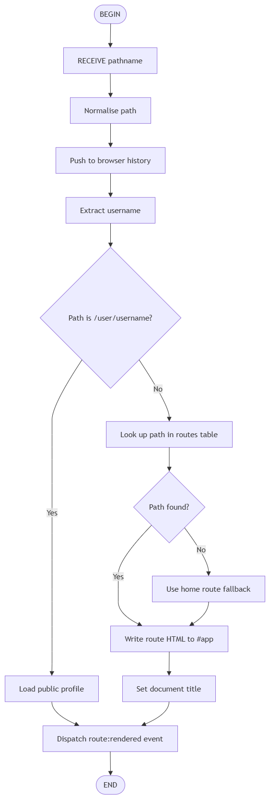
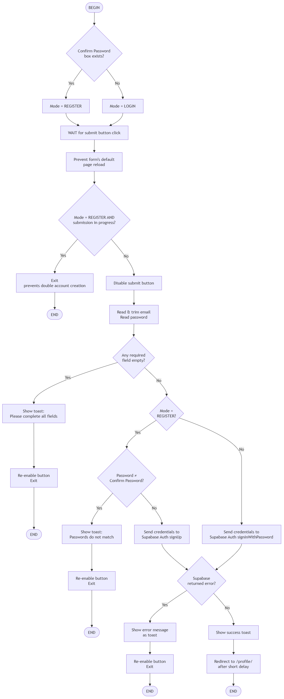
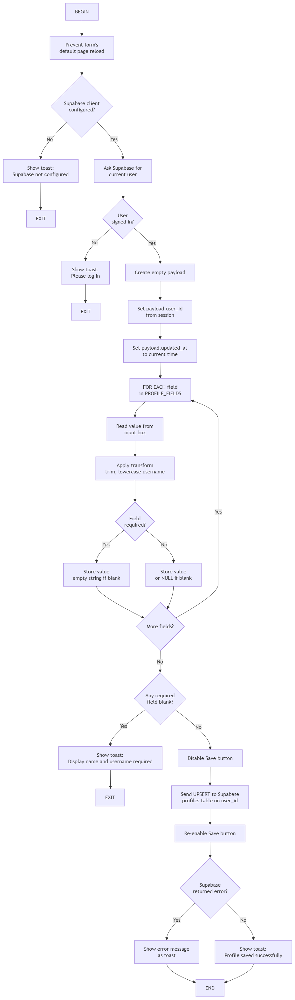
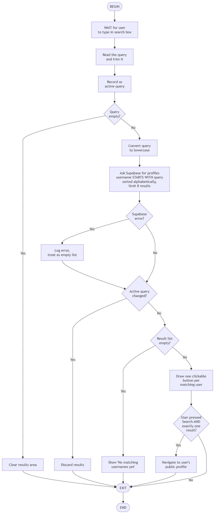

# Producing and Implementing

## Overview

The solution built is **Digital U**, a web-based digital business card. A user registers an account, fills in a profile with the contact details they choose to share, and receives a public page at `/user/<username>` that anyone can view or reach by tapping an NFC card. Other users can find them through a search box on the home page.

The finished solution is a **Single Page Application (SPA)** written in vanilla HTML, CSS and JavaScript, backed by **Supabase** (a hosted PostgreSQL database with a built-in authentication service). There is no server-side code of my own and no build step — the whole front end is static files, and every dynamic action happens in the browser talking directly to Supabase over HTTPS.

### File Structure

| File                                   | Role                                                                                                                              |
|----------------------------------------|-----------------------------------------------------------------------------------------------------------------------------------|
| `public/index.html`                    | The single page that has a navbar, an empty `<main id="app">` container, and a toast element. Every route renders into this shell |
| `public/static/js/app.js`              | Route table, client-side router, public profile rendering, user search, HTML escaping                                             |
| `public/static/js/auth.js`             | Registration, login, logout, navbar auth state, profile form loading and saving                                                   |
| `public/static/js/supabaseClient.js`   | Creates the Supabase client and exposes it to the app                                                                             |
| `public/static/css/style.css`          | All styling, including the mobile layout                                                                                          |
| `public/404.html`, `public/_redirects` | Deep-link recovery, so `/user/<username>` works on a static host (AKA Gitlab pages)                                               |
| `public/static/images`                 | Directory that holds the images used in the SPA                                                                                   |

>Note: The CSS and JS files have been minified. Full versions are available in files with large suffixed. 

<br>

> [style_large.css](../../public/static/css/style_large.css), [app_large.js](../../public/static/js/app_large.js), [auth_large.js](../../public/static/js/auth_large.js), [supabaseClient_large.js](../../public/static/js/supabaseClient_large.js)

### SPA

As the page never fully reloads, code that would normally run on page load has to be re-run every time a route is drawn. `renderRoute()` solves this by dispatching a custom event once the new HTML is in the DOM:

```javascript
document.title = `${route.title} | Digital U`;
// let other listeners know the page just changed
document.dispatchEvent(new Event('route:rendered'));
```

Both `auth.js` and `app.js` listen for it, which is how the navbar, the profile form and the search box re-initialise themselves after every navigation:

```javascript
document.addEventListener("DOMContentLoaded", initSupabaseAuth);
document.addEventListener("route:rendered", initSupabaseAuth);
```

`<main id='app'>` is where the unique HTML content is put for each 'page'. JS renders the new content upon when a different route is rendered.

### Version Control

Throughout development, git was used for version control, with changes committed to the repository at set intervals. The version control allows for changes to be rolled back at will. I used this when I reverted back to flask from Next.JS.

When not submitting and testing locally, the website was run using a `server.jar` file. To use it, navigate to the root directory and input the following into the terminal:

```bash
java -jar server.jar 8123    
```
8123 represents the port number, it can be changed.

## Flowcharts & Algorithms

### Algorithm 1 — SPA route rendering

**Purpose:** decide what to draw on screen when the URL changes, without reloading the page.

**Source:** `navigate()`, `normalisePath()`, `renderRoute()` in `app.js`.

```
1.  BEGIN
2.  RECEIVE pathname
3.  Normalise the path (strip query string and hash, remove /index.html, force exactly one trailing slash)
4.  Push the normalised path into browser history (address bar updates, no page reload)
5.  Extract the username from the path
6.  IF the path is of the form /user/<username> THEN
7.       Load the public profile for that username 
8.  ELSE
9.       Look up the path in the routes table
10.      IF the path is not found in the routes table THEN
11.           Use the home route as a fallback
12.      END IF
13.      Write the route's HTML into the <main id="app"> container
14.      Set the document title
15. END IF
16. Dispatch the "route:rendered" event so the auth and search modules re-initialise
17. END
```



### Algorithm 2 — Authentication

**Purpose:** create an account, or sign an existing user in, and hand credentials safely to Supabase Auth.

**Source:** `initSupabaseAuth()` in `auth.js`.

```
1.  BEGIN
2.  IF a "Confirm Password" box exists on the page THEN
3.       Mode = REGISTER
4.  ELSE
5.       Mode = LOGIN
6.  END IF
7.  WAIT for the submit button to be clicked
8.  Prevent the form's default page reload
9.  IF Mode = REGISTER AND a submission is already in progress THEN
10.      Exit (prevents a double click creating two accounts)
11. END IF
12. Disable the submit button
13. Read and trim the email; read the password
14. IF any required field is empty THEN
15.      Show toast "Please complete all fields"
16.      Re-enable the button and exit
17. END IF
18. IF Mode = REGISTER THEN
19.      IF password ≠ confirm password THEN
20.           Show toast "Passwords do not match"
21.           Re-enable the button and exit
22.      END IF
23.      Send the credentials to Supabase Auth signUp
24. ELSE
25.      Send the credentials to Supabase Auth signInWithPassword
26. END IF
27. IF Supabase returned an error THEN
28.      Show the error message as a toast
29.      Re-enable the button and exit
30. END IF
31. Show a success toast
32. Redirect to /profile/ after a short delay
33. END
```



### Algorithm 3 — Profile Saving

**Purpose:** validate the profile form and write it to the database as the signed-in user's row. This is the most involved algorithm in the solution.

**Source:** `saveProfile()` in `auth.js`.

```
1.  BEGIN
2.  Prevent the form's default page reload
3.  IF the Supabase client is not configured THEN
4.       Show toast "Supabase is not configured" and exit
5.  END IF
6.  Ask Supabase for the current user
7.  IF no user is signed in THEN
8.       Show toast "Please log in before saving your profile" and exit
9.  END IF
10. Create an empty payload
11. Set payload.user_id = the signed-in user's ID  (taken from the session, never from the form)
12. Set payload.updated_at = the current time
13. FOR EACH field in PROFILE_FIELDS DO
14.      Read the value from that field's input box
15.      Apply the field's transform (trim; also lowercase for username)
16.      IF the field is required THEN
17.           Store the value (empty string if blank)
18.      ELSE
19.           Store the value, or NULL if blank
20.      END IF
21. END FOR
22. IF any required field is blank THEN
23.      Show toast "Display name and username are required" and exit
24. END IF
25. Disable the Save button (prevents a double submit mid-save)
26. Send the payload to Supabase as an UPSERT on the profiles table, matched on user_id
27. Re-enable the Save button
28. IF Supabase returned an error THEN
29.      Show the error message as a toast
30. ELSE
31.      Show toast "Profile saved successfully"
32. END IF
33. END
```



### Algorithm 4 — Search

**Purpose:** find matching users as the visitor types, without flickering out-of-order results.

**Source:** `searchUsers()` and `initHomeSearch()` in `app.js`.

```
1.  BEGIN
2.  WAIT for the user to type in the search box
3.  Read the query and trim it
4.  Record it as the "active query"
5.  IF the query is empty THEN
6.       Clear the results area and exit (avoids listing every user)
7.  END IF
8.  Convert the query to lowercase
9.  Ask Supabase for profiles whose username STARTS WITH the query, sorted alphabetically, limited to 8 results
10. IF Supabase returned an error THEN
11.      Log the error and treat the result as an empty list
12. END IF
13. IF the active query has changed since this search started THEN
14.      Discard these results and exit  (a newer keystroke has taken over)
15. END IF
16. IF the result list is empty THEN
17.      Show "No matching usernames yet"
18. ELSE
19.      Draw one clickable button per matching user
20. END IF
21. IF the user pressed Search AND exactly one result was returned THEN
22.      Navigate straight to that user's public profile
23. END IF
24. END
```



## Security

### Cross-site scripting (XSS)

This is the most serious threat the solution faces, because the purpose of the website is to take text typed by one user and display it to another. Both `renderPublicProfile()` and `renderSearchResults()` build HTML strings and write them with `innerHTML`, which would execute any script tags a malicious user saved into their display name.

It is prevented by an escaping function, which is applied everytime:

```javascript
// escape special characters for safety
function escapeHtml(value) {
    // replace & first so the other replacements dont get double escaped
    return String(value ?? '')
        .replace(/&/g, '&amp;')
        .replace(/</g, '&lt;')
        .replace(/>/g, '&gt;')
        .replace(/"/g, '&quot;')
        .replace(/'/g, '&#39;');
}
```

The profile "title" is set with `textContent` rather than `innerHTML`, which cannot execute markup at all. This makes it safe from XSS.

### SQL injection

There is no hand-written SQL in the website. Every database operation goes through the Supabase client's query builder, which sends parameterised requests, which is where user input is transmitted as a value. This means it is never concatenated into a query string:

```javascript
const { data, error } = await supabase
    .from('profiles')
    .select('username, display_name')
    .or(`username.ilike.${safe}%,display_name.ilike.${safe}%`)
    .order('username', { ascending: true })
    .limit(8);
```
Malicious actors can attempt to use `' OR '1'='1`, which is a short line which will ALWAYS return `TRUE`, meaning it can be used to see if data exists in a table, meaning attempts can then be made to extract it. However in this website it would treated as a literal string, not as SQL, preventing its injection.

Using wildcard operators such as `%`, which if used by itself, will return all fields, also no longer works. (This was listed as a bug in the tracker, it has since been fixed.)

### Password handling and hashing

The website never stores, or transmits a password to any code I wrote. The password is passed straight from the input box to Supabase Auth:

```javascript
const { error } = await supabase.auth.signInWithPassword({
  email: inputEmail,
  password: inputPassword,
});
```

Supabase hashes passwords with bcrypt and stores them in its protected `auth` schema, which the public API key cannot read. My `profiles` table, which is public, contains no credentials at all.

### Broken access control

Two mechanisms stop a user editing someone else's profile:

1. Every profile read and write first calls `requireUser()`, which exits if nobody is signed in.
2. The owner of the row is taken from the authenticated session, never from anything the user can type:

```javascript
const payload = {
    user_id: user.id,
    updated_at: new Date().toISOString(),
};
```

Because there is no form field for `user_id`, a user cannot aim a save at another person's row.

### Transport security (HTTPS)

All traffic is encrypted in transit. GitLab Pages serves the site over HTTPS, and the Supabase endpoint is an `https://` URL, so every database and auth request is TLS-encrypted. Outbound profile links are also forced to HTTPS when the user omits a protocol:

```javascript
if (label === 'Website') {
    return /^https?:\/\//i.test(cleanValue) ? cleanValue : `https://${cleanValue}`;
}
```

Attempting to connect over HTTP will result in Gitlab Pages automatically redirecting you to HTTPS.

### Cross-site request forgery (CSRF)

CSRF is a web security attack that uses an authenticated user to execute unwanted actions on a web application.

CSRF is structurally very low-risk here. There are no cookie-authenticated endpoints of my own; Supabase authenticates each request with a bearer JWT held in browser storage and attached by JavaScript. A browser will not attach that token to a request forged by another site, so the classic CSRF pattern does not apply.

### Input validation

Validation runs at two layers. The HTML provides the first pass: `type="email"`, `required`, and a pattern on the phone field:

```
<input type="tel" name="profilePhone" placeholder="Phone Number" pattern="[0-9]{10}" id="profilePhone">
```
<br>

JavaScript then re-checks in `saveProfile()` and in the auth handlers, so validation is not lost if the browser's native check is bypassed. Both the register button and the Save button are also guarded against double submission, preventing duplicate accounts or duplicate rows:

```javascript
let isSubmitting = false;
// ...
if (isSubmitting) return;
isSubmitting = true;
submitButton.disabled = true;
```

### Other

There are still potential security weaknesses that the website still has.

| # | Risk                                                                                | Assessment and justification                                                                                                                                                                                                                                  |
|---|-------------------------------------------------------------------------------------|---------------------------------------------------------------------------------------------------------------------------------------------------------------------------------------------------------------------------------------------------------------|
| 1 | **Supabase URL and publishable key are directly in the code** (`supabaseClient.js`) | Originally this was a huge security risk, however after further research, enabling good RLS(Row Level Security) policies allows for the URL and publishable key to be published                                                                               |
| 2 | **Email verification is disabled**                                                  | Supabase's free tier caps built-in email at 2 per hour, which blocked proper sign-up email verification.  Consequence: accounts can be created with an email the user does not own. Fix: connect a custom SMTP provider and re-enable as a future improvement |
| 3 | **No multi-factor authentication**                                                  | The limitations of the free tier prevents multi-factor authentication                                                                                                                                                                                         |
| 7 | **All profiles are public**                                                         | This may appear to be a risk, but users are only required to input a display name, and username; everything else is optional                                                                                                                                  |
---