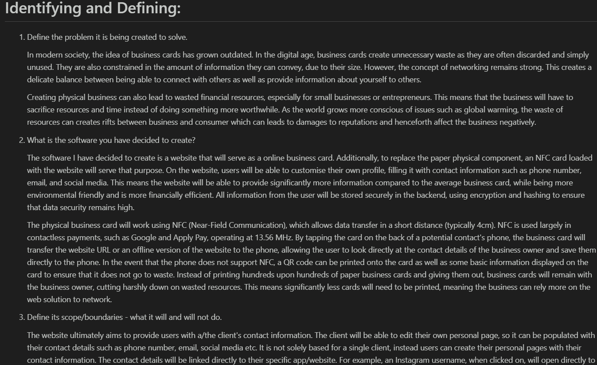
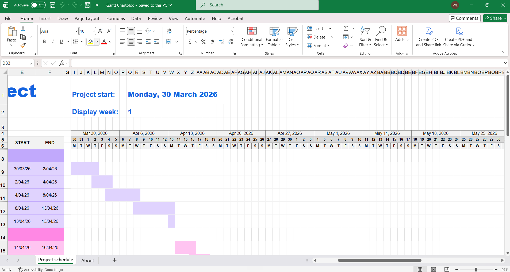

# 27/04/2026 **Week 1** – ePortfolio Creation

**Aims for the Week:**

- My aim for this week was to create the ePortfolio, share it with my teachers and begin brainstorming to begin the task. These are the first steps required. I planned to use the course work to work through creating the fork of the project and committing changes
- This is crucial to beginning the task.

**Progress:**

- I used the course work from Set 16 to learn how to use GitLab to create the ePortfolio for the task. I also learned how to commit changes as well as such basic markdown. I installed an extension on VSCode that allowed me to preview Markdown files so that will be especially helpful in the future.

**Challenges and Solutions**

- As I didn't do much this week, there were not a lot of problems that needed to be solved. However I did forget to make a journal entry for this week so I am doing it late and henceforth committing the changes late.

**Reflection:**

- This week was a good start, but I am quite behind and will have to pickup the pace fo my work. I need to ensure that I keep up to date with my journal.

**Aims for Next Week:**

Start the identifying and defining segment of the project.

# 04/05/2026 **Week 2** – Identifying and Defining

**Aims for the Week:**

- The aim this week is to complete the identifying and defining part of the documentation for the project. I have a basic idea from brainstorming so I will be expanding upon that. I will not really be using any outside resources for this week.
- This section will be essential so establish a base line for what I aim to do.

**Progress:**

- This week I completed the Identifying and Defining section of the documentation. I used and filled in the template given, ensuring as much detail was typed. 
- 

**Challenges and Solutions**

- Coming up with the boundaries was difficult. Given that I started with a basic idea, the boundaries were not clearly defined as of yet. To fix this, I brainstormed and expanded on the basic idea so that I had a more advanced understanding of what I wanted to achieve.

**Reflection:**

- This week I worked quite fast, but I am still behind so this pace will need to be maintained.

**Aims for Next Week:**

For next week, I aim to start immediately on the Research and Planning section of the documentation.

# 11/05/2026 **Week 3** – Research and Planning

**Aims for the Week:**

- This week I want to get a client, and begin the Research and Planning Section of the documentation. I will be using the course work to aid in this.
- This will provide the major framework for the actual solution as well as complete more documentation.

**Progress:**

- Created a Gantt Chart
  - Used an Excel template for it
  - 
- Looked at using Supabase for backend development
  - Teacher gave approval for its use
  - Started basic implementation
  - Researched using Youtube as well as reading the official documentation for it
  - Have decided that I want to use the flask version for its integration
- Created Bibliography for links used
- Worked on basic frontend for the website

**Challenges and Solutions**

- Gantt chart took a long time to make. It was hard to work with a template I had not used before, especially with the conditional formatting. However over time it became easier to use and I eventually got it done.
- Struggled so much on deploying the website. I had to create a new project to test, once I got that working it didn't work on the main due to it being private. Had to mess around with settings. Took about 2 hours to get index.html to display.
- Ended up with over 15 different pipelines all failing. Used a youtube tutorial for it to get it to finally work.
- It then turns out I put my api keys onto the repository, which is bad for security. However given that this is not for production, I kept it as is.

**Reflection:**

- This week was a lot of progress done for the actual solution, but lagging a bit behind in the documentation. I underestimated how difficult it would be to integrate Supabase into the code so I did not touch it yet. This was due to the Canvas shutdown due to a breach, which meant I could not access the resources required, which prompted me to just work on the website. For next time, I would like to start on documentation first and finish that ASAP.

**Aims for Next Week:**

Further implement Supabase and continue with Documentation

# 20/05/2026 **Week 4** – Attempting Next.js

**Aims for the Week:**

- Trial swapping the frontend over to Next.js instead of Flask
- The framework choice underpins the whole solution, so I wanted Next.js's built-in routing and components to make the build easier to maintain

**Progress:**

- Tested how Next.js would handle the Supabase integration
- Learned how Next.js structures routing and components, but found it added more complexity than value for this project
- Ultimately reverted back to Flask

**Challenges and Solutions**

- Next.js was more complex than expected and I couldn't get it working cleanly with what I already had. Migrating the existing HTML/CSS/JS kept breaking things.
- To diagnose it I read the build errors and followed the Next.js documentation to try to fix the migration.
- Ultimately, I chose to revert to Flask rather than sink more time into a full rewrite, which would be faster and lower-risk given how much was already built.

**Reflection:**

- A bit of a wasted week for visible output, but useful to rule Next.js out early. The main skill I took away was knowing when to cut losses on a tool.
- Next time I'd prototype a framework switch on a small copy before committing to migrating the whole project. Still behind — need to commit to Flask and push forward.

**Aims for Next Week:**

Commit to Flask and get back to steady progress on the solution and documentation.

# 27/05/2026 **Week 5** – Exam Break

**Aims for the Week:**

- Focus on upcoming exams
- Keep the project ticking over where possible, since falling behind in other subjects would cost me more than a paused project

**Progress:**

- Minimal progress on the project this week
    - Did some documentation, mainly last week's journal entry
- Prioritised studying and sitting exams

**Challenges and Solutions**

- Exams took priority, so I did not do much.

**Reflection:**

- Not much done on the solution, but exams had to come first. I'll be further behind afterwards, so I'll need to pick the pace back up once they're over.
- What I'd do differently: schedule project milestones around the exam block

**Aims for Next Week:**

Get back into the project once exams settle down.

# 04/06/2026 **Week 6** – Exams Continued

**Aims for the Week:**

- Get through the rest of my exams

**Progress:**

- Again minimal progress on the project
- Finished off exams

**Challenges and Solutions**

- Not much work done due to exams

**Reflection:**

- Two weeks now with little project output. It's a real dent in my timeline and I'll need to be disciplined to claw it back. On the plus side, exams are done.
- What I'd do differently: keep the documentation ticking over during quiet weeks, since writing doesn't need the same focus as coding and would have kept me moving.

**Aims for Next Week:**

Properly restart the project and rebuild momentum on the solution.

# 10/06/2026 **Week 7** – Local Flask + Supabase

**Aims for the Week:**

- Continue the project properly now exams are over
- Commit to Flask and get Supabase working, since the backend/auth is essential before any user-specific features can be built

**Progress:**

- Went back to Flask for good
- Worked entirely locally rather than fighting deployment
- Got Supabase integrated and talking to the app locally
- Learned how to configure the Supabase client and connect it to Flask

**Challenges and Solutions**

- Deployment had been the biggest time-sink previously, so I deliberately worked locally this week to remove that friction and actually make progress on features.
- Wiring up Supabase took some trial and error; I used the official Supabase documentation and YouTube tutorials to get the client connected, and tested locally after each change to confirm it worked.

**Reflection:**

- A much more productive week. I got more done than in the previous few weeks combined, and my understanding of the Supabase client improved a lot.
- What I'd do differently: I should have separated "building features" from "deploying" much earlier instead of letting deployment block feature progress. Nothing committed yet since it was all local, but the foundation is back.

**Aims for Next Week:**

Keep building out the Flask solution and its Supabase-backed features.

# 19/06/2026 **Week 8** – Local Features + Documentation

**Aims for the Week:**

- Keep building out features locally on the Flask + Supabase build
- Catch up on documentation alongside the coding, since the documentation is marked as heavily as the solution and had fallen behind

**Progress:**

- Continued developing core features locally (auth and page logic)
- Worked on documentation in parallel to close the gap left by the quiet weeks
- Tested changes locally as I went

**Challenges and Solutions**

- Splitting time between coding and documentation was tricky, so I alternated between them in blocks to avoid burning out on either.
- Keeping the docs in sync with what I was building took some back-and-forth; I referred back to my course notes and the task requirements to make sure each section matched what I'd actually implemented.

**Reflection:**

- A solid, balanced week. Doing both code and documentation together felt more sustainable and helped me claw back some of the lost time; I also got better at writing documentation as I build rather than after.
- What I'd do differently: document decisions immediately when I make them, so I'm not reconstructing my reasoning later. Still working locally, so nothing committed yet.

**Aims for Next Week:**

Continue features and documentation, and start thinking about getting the build committed and deployed again.

# 25/06/2026 **Week 9** – More Features + Docs

**Aims for the Week:**

- Keep pushing on local features
- Continue documentation to stay on top of it, so the write-up keeps pace with the solution rather than piling up at the end

**Progress:**

- Built out more of the local Flask + Supabase functionality
- Kept documentation moving alongside the code
- Tested features locally before considering committing

**Challenges and Solutions**

- Some features were more involved than expected and needed reworking. I diagnosed the issues by testing locally and using the browser console to trace what was failing, then referred to the Supabase docs and YouTube where I got stuck, iterating until each feature behaved before moving on.

**Reflection:**

- Another steady week working locally, and I'm getting quicker at debugging with the console. The build is getting close to something I'd want to commit and deploy.
- What I'd do differently: I've been out of the repo for a while, so I should have been committing local checkpoints instead of leaving everything uncommitted — re-tackling deployment now feels riskier than it needed to.

**Aims for Next Week:**

Get the local build committed and take another run at deployment.

# 03/07/2026 **Week 10** – Move to SPA

**Aims for the Week:**

- Get the local build committed and deployed
- Keep pushing on the frontend, as the site needs to be live and usable for the client to actually access it

**Progress:**

- Did more frontend work (login, register and profile pages, plus lots of CSS and mobile layout)
- Deployed the site
- Kept API keys into JS
- Re-architected the app into a Single Page Application (SPA)
- Learned the key difference between static and dynamic hosting the hard way, and what a SPA is

**Challenges and Solutions**

- Deployed, then realised it didn't work: GitLab Pages only supports static pages, but I'd built a dynamic application. I diagnosed this by reading the pipeline output and the GitLab Pages documentation, which made the static-only limitation clear.
- Attempted to use Frozen-Flask to generate a static version, but it didn't work well since a new build had to be triggered every time something changed. I researched the fix using YouTube and Copilot to understand my options.
- To solve it properly, I moved the whole thing to a SPA so it could run as static content on GitLab Pages while still being dynamic client-side

**Reflection:**

- A massive but frustrating week. I lost time to the GitLab Pages limitation, but I came out of it understanding static vs dynamic hosting and SPA architecture far better. Lots committed after weeks of local-only work.
- What I'd do differently: check the hosting platform's constraints before choosing an architecture, not after building it

**Aims for Next Week:**

Build on the SPA structure — flesh out the profile functionality.

# 10/07/2026 **Week 11** – Profile Feature + Cleanup

**Aims for the Week:**

- Build out the profile functionality on the SPA
- Clean up the leftover Flask code, since the profile is a core requirement and the dead templates were cluttering the codebase

**Progress:**

- Added the profile logic (auth and app JS)
- Styled the profile form with CSS
- Deleted the now-deprecated Flask templates that were no longer needed

**Challenges and Solutions**

- The old Flask templates were dead weight after the SPA move, so I removed them to keep the codebase clean and avoid confusion.
- Getting the profile logic to talk to Supabase correctly took some tweaking of the auth handling. I diagnosed the issues using console logs to see where the auth calls were failing, and referred to the Supabase docs and Copilot to correct how I was handling the session.

**Reflection:**

- A focused, productive week. The profile feature is a big part of the solution and it's now working, and my understanding of Supabase auth/session handling improved. Removing the old templates made the project feel much tidier.
- What I'd do differently: Focus a bit more on documentation, it is lacking a bit

**Aims for Next Week:**

Tidy up remaining features and start moving toward testing and evaluation.

# 15/07/2026 **Week 12** – Testing Setup + SPA Pages

**Aims for the Week:**

- Start testing the website
- Continue building out the SPA, since I can't evaluate the solution against its requirements without being able to test it

**Progress:**

- Realised I couldn't test the website locally as it was
- Asked Copilot for help, which generated a `server.jar` file that I've been using to serve and test it since
  - To use it, go to root folder which contains 'public', then put into console: `java -jar server.jar 8123` which will serve the website on port 8123
- Built new webpages in JS for the SPA
- Turned off email verification due to Supabase limitations (its built-in email sending is capped at 2 per hour)

**Challenges and Solutions**

- I couldn't test locally, which blocked me. I diagnosed that the SPA needed to be served over a local web server rather than opened as a file; Copilot helped me set up the `server.jar` to do this, which unblocked testing.
- Sign-up testing kept failing on the email step. Reading the Supabase dashboard/errors showed its default email limit (2 per hour for free version) was the cause, so I disabled email verification to keep testing moving. I will most likely keep it off for final product as well.

**Reflection:**

- A bit of a workaround-heavy week, but I got unblocked on testing, which was the important thing, and I learned why a SPA has to be served rather than opened directly.
- Disabling email verification is a compromise, keep it in mind

**Aims for Next Week:**

Finish the build, get the site uploaded, and push into proper testing and evaluation.

# 22/07/2026 **Week 13** – Website Upload + Testing

**Aims for the Week:**

- Get the finished website uploaded and committed
- Move properly into testing and evaluation

**Progress:**

- Uploaded the completed website (large commit covering the SPA, styling, auth and Supabase client)
- Added social/contact icons and updated the logo
- Continued testing the site using the `server.jar` setup
- Updated the Bug Tracking and Fixing documentation as I found and fixed issues
- Finalised documentation
- Did video
- submitted

**Challenges and Solutions**

- Pulling everything together into one clean upload took some care to make sure nothing local-only was left out; I checked the diff before committing to confirm every needed file was included.
- Testing kept surfacing small bugs. I diagnosed them with the browser console and by reproducing each one, logged them in the Bug Tracking document, and worked through them one at a time, using Copilot and the Supabase docs where a fix wasn't obvious.

**Reflection:**

- I have finished, a massive weight has been lifted from my shoulders
- I am proud of what I have done
- What I'd do differently: Finish earlier where possible.

**Aims for Next Week:**

NIL - FINISHED